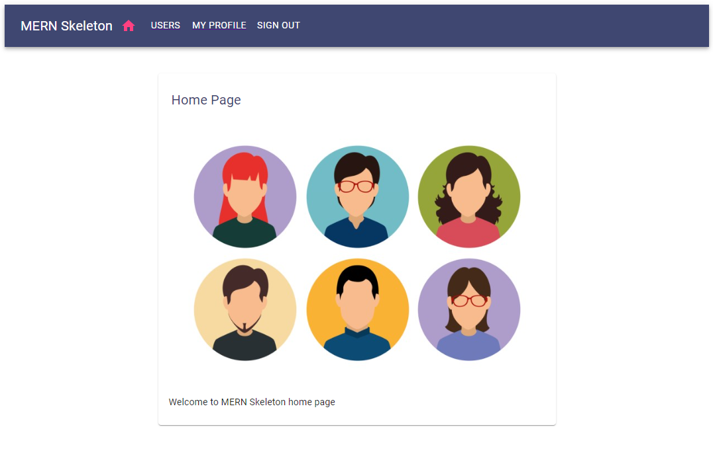
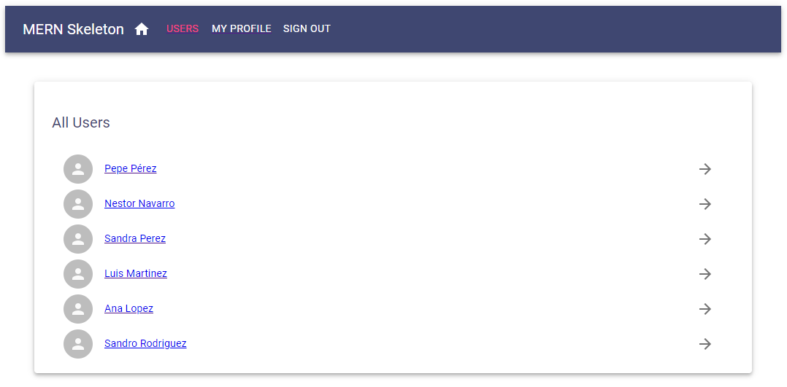
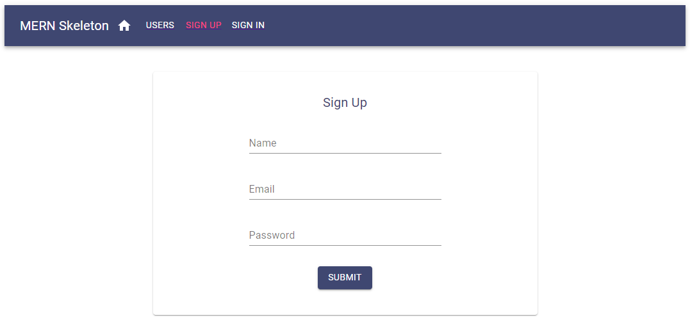
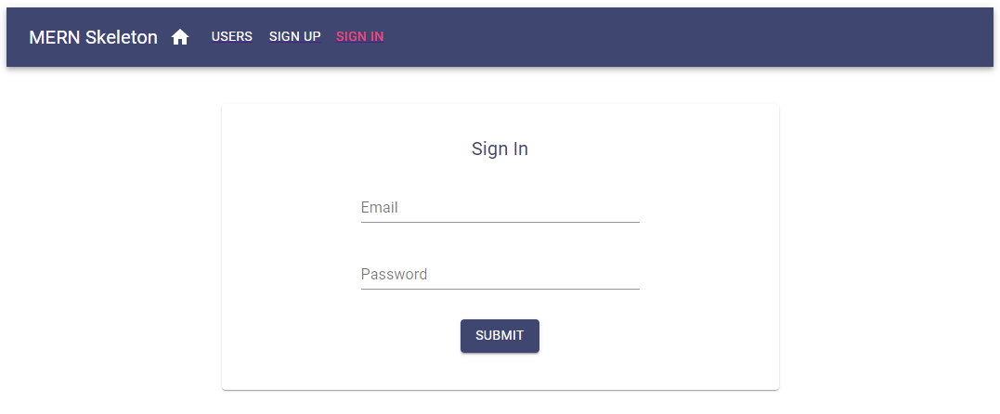
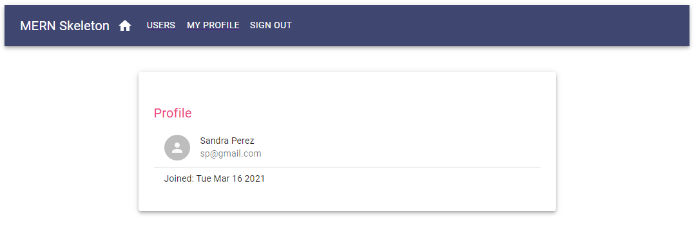
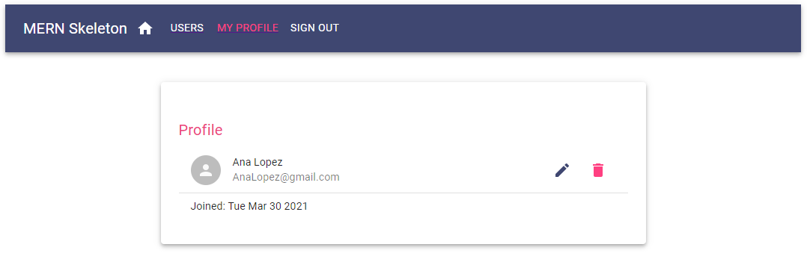
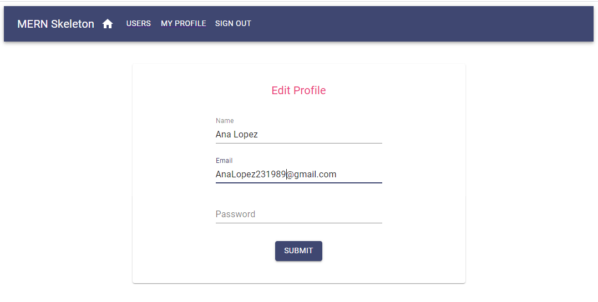
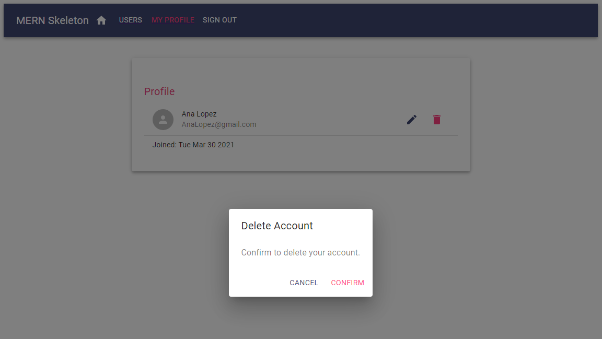

# MERN-skeleton

Template with all the necessary backend and frontend configuration to begin with a MERN stack project.

## *App Overview*

**********************************************************************************************************

### Main view

### Users

### Sign Up

### Sign In

### Public profiles

### Private profile info

### Edit profile

### Delete profile

